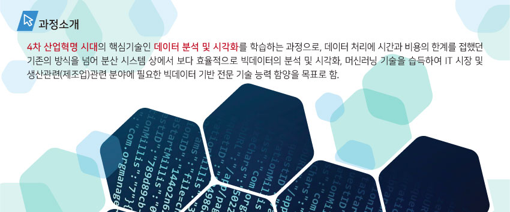
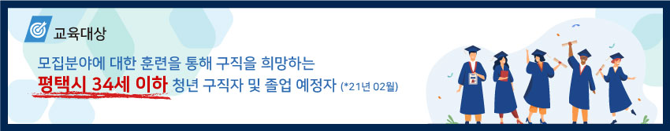
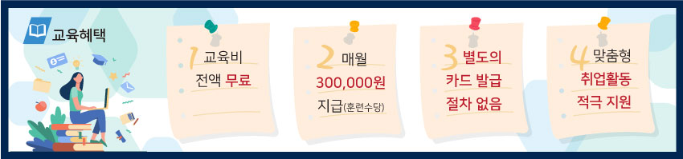
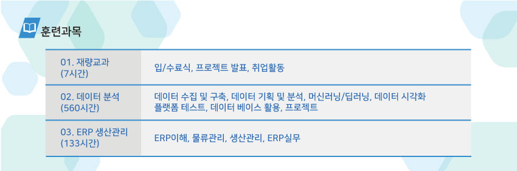
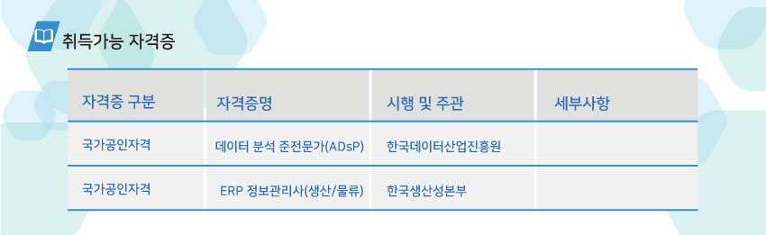
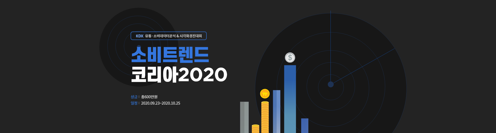
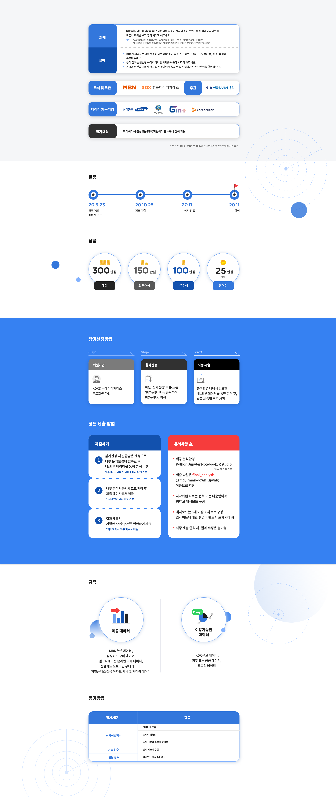
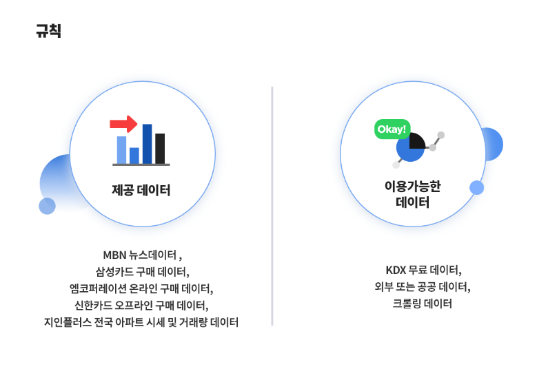

```{r setup, include=FALSE}
knitr::opts_chunk$set(echo = TRUE)
```

# KDX 소비트랜드 시각화 경진대회 우수상 후기  


## 대회  참가배경  
- 나는 현재 평택시에서 국비로 지원해주는 4차 산업혁명 우수인재 발굴 교육을 수강중에 있다.   

  
  
  
  


 이 과정을 참여하면서 마치 고등학교 시절로 돌아간 것처럼 정신없이 공부를 하고 있다. 나는 이 과정을 통해서  
 - ERP 정보관리사 자격증 취득  
 - 빅데이터 관련 공모전 참여  
 - ADsP(빅데이터 분석 준전문가)자격증 취득 
 
 을 도전하고 있는데 현재까지 ERP 정보관리사 자격증은 취득을 완료하였고, 빅데이터 관련 공모전은 1개를 나가고 2번째 공모전을 준비중에 있다. ADsP 자격증은 현재 공부중으로 다음주 일요일에 시험을 볼 예정이다.   
   
무튼! 우리가 처음 참여했던 공모전이 바로 **'KDX 2020소비트랜드 시각화경진대회'** 였다.  
  

우리가 R이라는 데이터 분석 프로그램을 배운지 정확히 1주일도 채 되지 않았을 무렵 우리는 "일단 실전에 부딪히면서 배워서 금방 실력이 는다"는 강사님의 무시무시한 말과 함께 추천해주시는 공모전에 참가신청서를 넣었다.  
  
팀 참가가 가능했기에 우리는 최대한 모자란 힘을 보태고자 3명이서 팀을 이루어 참가를 했고, 대략 10일 가량의 준비기간을 가질 수 있었다.   
다행히(?) 강사님의 배려로 인해 수업 시간 중간 중간 공모전을 준비할 시간을 가질 수 있었고, 우리는 데이터를 확인하면서 우리의 방향성을 잡았다.  
  
  
KDX에서 제공해준 데이터는 다음과 같았다.  




