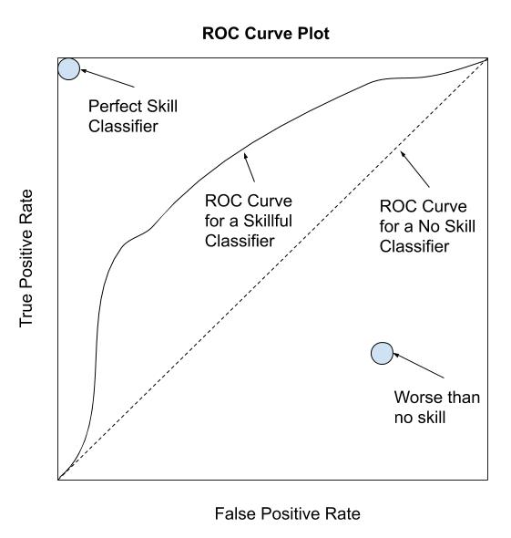
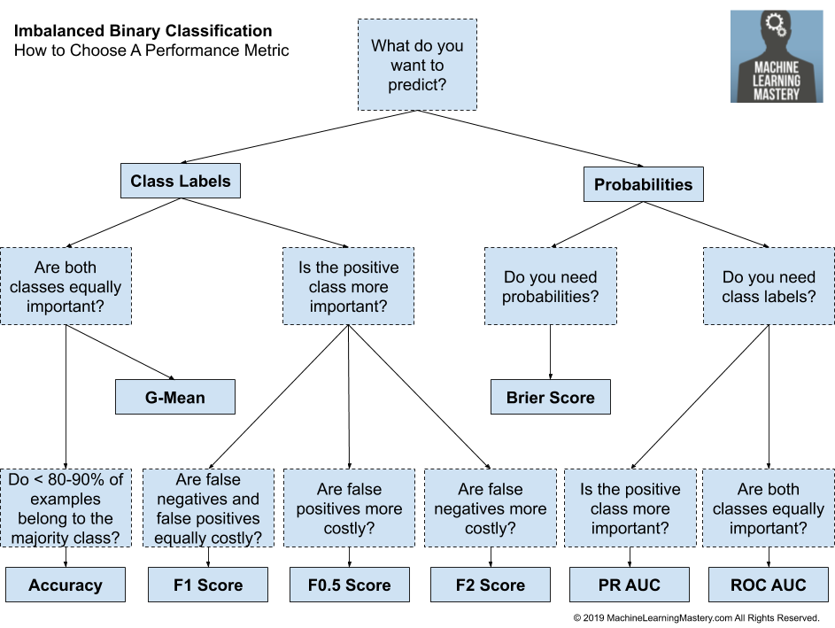

```{r setup, include=FALSE}
knitr::opts_chunk$set(echo = TRUE)
```


# Tour of Evaluation Metrics for Imbalanced Classification  
# 균형분류를 위한 평가 지표 둘러보기 

by Jason Brownlee on January 8, 2020 in Imbalanced Classification
(https://machinelearningmastery.com/tour-of-evaluation-metrics-for-imbalanced-classification/)


2020년 1월 14일 마지막 업데이트

분류자는 이를 평가하는 데 사용된 메트릭만큼만 적합합니다.

모형을 평가하기 위해 메트릭을 잘못 선택한 경우 불량 모형을 선택하거나 최악의 경우 모형의 예상 성능에 대해 오도할 수 있습니다.

적용 기계 학습에서는 일반적으로 적절한 측정지표를 선택하는 것이 어렵지만, 불균형 분류 문제에서는 특히 어렵다. 첫째, 널리 사용되는 대부분의 표준 메트릭은 균형잡힌 클래스 분포를 가정하기 때문에, 그리고 일반적으로 모든 클래스가 아니므로 모든 예측 오차가 불균형 분류에 대해 동일하지 않기 때문입니다.

이 튜토리얼에서는 불균형 분류에 사용할 수 있는 메트릭을 검색합니다.

이 튜토리얼을 완료하면 다음과 같은 사실을 알 수 있습니다.

분류를 위해 메트릭을 선택하는 과제와 치우친 클래스 분포가 있을 때 특히 어려운 방법에 대해 설명합니다.
분류기 모델을 평가하기 위한 세 가지 주요 유형의 메트릭을 순위, 임계값 및 확률이라고 하는 방법.
어디서부터 시작해야 할지 모르는 경우 불균형 분류에 대한 메트릭을 선택하는 방법.
단계별 튜토리얼과 파이썬 소스 코드 파일을 포함한 파이썬과의 새로운 책 Imbalanced Classification with Python으로 프로젝트를 시작하십시오.

## 자습서 개요
본 자습서는 다음과 같이 세 부분으로 나뉩니다.

1. 평가 지표의 과제
2. 분류기 평가 지표의 분류법
3. 평가 메트릭 선택 방법

## 평가 지표의 과제

평가 메트릭은 예측 모형의 성능을 수량화합니다.

여기에는 일반적으로 데이터 집합에서 모델을 교육하고, 모델을 사용하여 교육 중에 사용되지 않은 홀드아웃 데이터 집합에 대한 예측을 수행한 다음, 예측을 홀드아웃 데이터 집합의 예상 값과 비교하는 작업이 포함됩니다.

분류 문제의 경우 메트릭은 예상 클래스 레이블을 예측 클래스 레이블과 비교하거나 해당 문제에 대한 클래스 레이블의 예측 확률을 해석하는 것을 포함합니다.

모델을 선택하고 데이터 준비 방법을 함께 사용하는 것은 평가 메트릭에 의해 안내되는 검색 문제입니다. 실험은 다른 모델로 수행되며 각 실험의 결과는 미터법으로 정량화된다.  

***평가방안은 분류성능 평가와 분류기 모델링 지도에 모두 중요한 역할을 한다.***   
  
  
균형분류를 위한 평가 지표 둘러보기
으로 제이슨 브라운리 에 January 8, 2020 에서 불균형 분류
트윗  공유
2020년 1월 14일 마지막 업데이트

분류자는 이를 평가하는 데 사용된 메트릭만큼만 적합합니다.

모형을 평가하기 위해 메트릭을 잘못 선택한 경우 불량 모형을 선택하거나 최악의 경우 모형의 예상 성능에 대해 오도할 수 있습니다.

적용 기계 학습에서는 일반적으로 적절한 측정지표를 선택하는 것이 어렵지만, 불균형 분류 문제에서는 특히 어렵다. 첫째, 널리 사용되는 대부분의 표준 메트릭은 균형잡힌 클래스 분포를 가정하기 때문에, 그리고 일반적으로 모든 클래스가 아니므로 모든 예측 오차가 불균형 분류에 대해 동일하지 않기 때문입니다.

이 튜토리얼에서는 불균형 분류에 사용할 수 있는 메트릭을 검색합니다.

이 튜토리얼을 완료하면 다음과 같은 사실을 알 수 있습니다.

분류를 위해 메트릭을 선택하는 과제와 치우친 클래스 분포가 있을 때 특히 어려운 방법에 대해 설명합니다.
분류기 모델을 평가하기 위한 세 가지 주요 유형의 메트릭을 순위, 임계값 및 확률이라고 하는 방법.
어디서부터 시작해야 할지 모르는 경우 불균형 분류에 대한 메트릭을 선택하는 방법.
단계별 튜토리얼과 파이썬 소스 코드 파일을 포함한 파이썬과의 새로운 책 Imbalanced Classification with Python으로 프로젝트를 시작하십시오.

슬슬 출발 해야지.

Tour of Evaluation Metrics for Imbalanced Classification
균형분류를 위한 평가 지표 둘러보기
트래비스 와이즈의 사진, 몇 가지 권한은 유보되어 있습니다.

자습서 개요
본 자습서는 다음과 같이 세 부분으로 나뉩니다.

평가 지표의 과제
분류기 평가 지표의 분류법
평가 메트릭 선택 방법
평가 지표의 과제
평가 메트릭은 예측 모형의 성능을 수량화합니다.

여기에는 일반적으로 데이터 집합에서 모델을 교육하고, 모델을 사용하여 교육 중에 사용되지 않은 홀드아웃 데이터 집합에 대한 예측을 수행한 다음, 예측을 홀드아웃 데이터 집합의 예상 값과 비교하는 작업이 포함됩니다.

분류 문제의 경우 메트릭은 예상 클래스 레이블을 예측 클래스 레이블과 비교하거나 해당 문제에 대한 클래스 레이블의 예측 확률을 해석하는 것을 포함합니다.

모델을 선택하고 데이터 준비 방법을 함께 사용하는 것은 평가 메트릭에 의해 안내되는 검색 문제입니다. 실험은 다른 모델로 수행되며 각 실험의 결과는 미터법으로 정량화된다.

평가방안은 분류성능 평가와 분류기 모델링 지도에 모두 중요한 역할을 한다.

— 불균형 데이터의 분류: A Review, 2009.

분류 정확도 또는 분류 오류와 같은 분류 예측 모형을 평가하는 데 널리 사용되는 표준 메트릭이 있습니다.

표준 메트릭은 대부분의 문제에 대해 잘 작동하며, 이것이 표준 메트릭이 널리 채택되는 이유입니다. 그러나 모든 측정 기준은 문제에 대한 가정이나 문제에서 무엇이 중요한지에 대한 가정을 한다. 따라서 귀하 또는 프로젝트 이해관계자가 모델 또는 예측에 중요하다고 생각하는 것을 가장 잘 포착하는 평가 메트릭을 선택해야 하며, 이로 인해 모형 평가 메트릭의 선택이 어려워집니다.

이 도전은 클래스 분배에 꼬투리가 있을 때 더욱 어려워진다. 그 이유는 많은 표준 메트릭이 소수 클래스와 다수 클래스 간의 1:100 또는 1:1000 비율과 같이 클래스가 불균형하거나 심각하게 불균형되어 있을 때 신뢰할 수 없거나 오해의 소지가 있기 때문입니다.  


***클래스 불균형의 경우, 왜곡되지 않은 데이터에 사용되는 기본적이고 비교적 강력한 절차가 데이터를 왜곡할 때 비참하게 분해될 수 있기 때문에 문제는 더욱 심각합니다.***  

— 187페이지, 불균형 학습: 기초, 알고리즘 및 애플리케이션, 2013년

예를 들어, 심각한 불균형 분류 문제에 대한 분류 정확도를 보고하는 것은 위험할 정도로 오해를 불러일으킬 수 있다. 프로젝트 이해관계자들이 결과를 이용하여 결론을 도출하거나 새로운 프로젝트를 계획하는 경우이다.  

***실제로 불균형 도메인에서 공통 메트릭을 사용하면 최적 이하의 분류 모델로 이어질 수 있으며, 이러한 조치는 치우친 도메인에 대해 무감각하기 때문에 잘못된 결론을 내릴 수 있습니다***  

— 2015년 불균형 분포에 따른 예측 모델링 조사.

중요한 것은 불균형 분류 작업을 할 때 종종 다른 평가 메트릭이 요구된다는 것입니다.

모든 클래스를 동등하게 중요하게 취급하는 표준 평가 지표와 달리 불균형 분류 문제는 일반적으로 소수 계층과의 분류 오류를 다수 계층의 것보다 더 중요하게 평가한다. 이와 같이 성과 지표는 소수 계층에 초점을 맞추는 것이 필요할 수 있는데, 소수 계층은 유효 모델을 교육하는 데 필요한 관측치가 부족하기 때문에 어려움을 겪게 됩니다.  

***불균형 데이터 세트의 주요 문제는 데이터 세트가 사용 가능한 데이터 샘플에서 잘 표현되지 않는 경우 성능에 대한 사용자 선호 편향과 연관되어 있다는 사실에 있습니다.***  

— 2015년 불균형 분포에 따른 예측 모델링 조사.

이제 모델 평가 메트릭을 선택해야 하는 과제에 대해 잘 알고 있으므로 선택할 수 있는 메트릭의 몇 가지 예를 살펴보겠습니다.  

## 분류기 평가 지표의 분류법

분류자 모델을 평가할 때 선택할 수 있는 메트릭은 수십 개이며, 학계에서 제안하는 애완동물 버전의 메트릭스를 모두 고려할 경우 수백 개일 수 있습니다.

여러분이 선택할 수 있는 측정 기준을 다루기 위해, 우리는 Cesar Ferri 등이 2008년 논문 "분류를 위한 성능 측정의 실험적 비교"에서 제안한 분류법을 사용할 것이다. 2013년 책 '임밸런스 러닝'에서도 채택됐는데 유용성이 입증된 것 같습니다.

평가 메트릭을 세 가지 유용한 그룹으로 나눌 수 있습니다. 다음과 같습니다.

1. 임계값 메트릭
2. 랭킹 메트릭스
3. 확률 메트릭스.
  
  
  이 중분류는 개업자들이 분류기에 사용하는 최상위 측정기준, 특히 불균형 분류기준이 분류법에 깔끔하게 들어맞기 때문에 유용하다.  
    
    
***여러 기계 학습 연구자들이 분류의 맥락에서 사용되는 세 가지 평가 지표 계열을 식별하였다. 이는 임계값 메트릭(예: 정확도 및 F-측정), 순위 방법 및 메트릭(예: 수신기 작동 특성(ROC) 분석 및 AUC), 확률론적 메트릭(예: 루트 평균 오차)입니다.***  

— 189페이지, 불균형 학습: 기초, 알고리즘 및 애플리케이션, 2013년

각 조별로 차례로 자세히 살펴보겠습니다.

##불균형 분류를 위한 임계값 메트릭

임계값 메트릭은 분류 예측 오류를 수량화하는 메트릭입니다.

즉, 예측 클래스가 홀드아웃 데이터 집합에서 예상 클래스와 일치하지 않는 경우의 비율, 비율 또는 비율을 요약하도록 설계되었습니다.  

***임계값 및 오류의 질적 이해에 기반한 메트릭 […] 이러한 측정은 오류 수를 최소화하기 위해 모델을 원할 때 사용됩니다.***  

— 분류용 성능 측정의 실험적 비교, 2008

아마도 가장 널리 사용되는 임계값 메트릭은 분류 정확도입니다.

**- 정확도 = 올바른 예측 / 총 예측**

그리고 분류 오류라고 하는 분류 정확도의 보완.

**- 오류 = 잘못된 예측 / 총 예측**

널리 사용되었지만 분류 정확도는 불균형 분류에 거의 보편적으로 부적절하다. 그 이유는, 높은 정확도(또는 낮은 오차)는 다수 클래스만을 예측하는 스킬 모형으로 달성할 수 있기 때문입니다.

분류 정확도 오류에 대한 자세한 내용은 자습서를 참조하십시오.

- 불균형 계층분포를 위한 분류정확성 오류

불균형한 분류 문제의 경우, 일반적으로 다수계급을 음의 결과(예: "변동 없음" 또는 "부정 테스트 결과")라고 하고, 소수계급을 양의 결과(예: "변화" 또는 "양성 테스트 결과")라고 한다.

**-전공수업** : 부정적인 결과, 0등급.
**-마이너리티 클래스**: 긍정적인 결과, 1등급.

대부분의 임계값 메트릭은 이진(2등급) 분류 문제에 대한 혼동 행렬에 사용되는 항으로 가장 잘 이해할 수 있습니다. 이는 메트릭이 이진 분류에 사용할 수 있도록 제한되어 있다는 것을 의미하지 않습니다. 측정되는 내용을 빠르게 이해하는 간단한 방법입니다.

혼동 행렬은 예측 모형의 성능뿐만 아니라 정확하게 예측되는 클래스, 부정확하게 예측되는 클래스, 그리고 어떤 유형의 오류가 발생하는지에 대한 더 많은 통찰력을 제공합니다. 이러한 유형의 혼동 행렬에서 표의 각 셀에는 다음과 같이 요약된 구체적이고 잘 이해된 이름이 있습니다.  


               | Positive Prediction | Negative Prediction
Positive Class | True Positive (TP)  | False Negative (FN)
Negative Class | False Positive (FP) | True Negative (TN)

한 클래스에 집중하기 때문에 불균형 분류에 유용할 수 있는 두 가지 메트릭 그룹이 있습니다. 즉, 민감도 특성과 정밀도 리콜입니다.

**민감도-특성 메트릭**
민감도는 진정한 양성률을 말하며 양성계급을 얼마나 잘 예측했는지를 요약한다.

**-민감도 = TruePositive / (TruePositive + FalseNegative)**

구체성은 민감도, 즉 진정한 음수율을 보완하는 것으로, 음수급을 얼마나 잘 예측했는지를 요약한다.

**- 구체성 = TrueNegative / (FalsePositive + TrueNegative)**
불균형 분류의 경우, 민감도가 특수성보다 더 흥미로울 수 있습니다.

민감도와 구체성은 기하 평균 또는 G-평균이라고 불리는 두 관심사의 균형을 이루는 단일 점수로 결합될 수 있다.

**-G-평균 = sqrt(감도 * 구체성)**

**정밀도-호출 메트릭**
정밀도는 양의 클래스에 속하는 양의 클래스에 할당된 예제의 비율을 요약합니다.

**- 정밀도 = TruePositive / (TruePositive + FalsePositive)**
리콜은 양의 클래스가 얼마나 잘 예측되었는지 그리고 민감도와 동일한 계산인지 요약합니다.

**- 리콜 = TruePositive / (TruePositive + FalseNegative)**
정밀도와 리콜은 F-점수 또는 F-척도라고 불리는 두 가지 우려의 균형을 추구하는 단일 점수로 결합될 수 있다.

**- F-측정 = (2 * 정밀도 * 호출) / (정밀 + 호출)**
F-측정은 불균형 분류에 대해 널리 사용되는 메트릭입니다.

Fbeta-me Measure는 고조파 평균 계산에서 정밀도와 회수량의 균형을 베타라는 계수에 의해 제어하는 F 측정의 추상화이다.

**- Fbeta-측정 = ((1 + 베타^2) * 정밀도 * 리콜) / (베타^2 * 정밀도 + 리콜)**
불균형 분류를 위한 정밀도, 회수 및 F-측정에 대한 자세한 내용은 자습서를 참조하십시오.

- 균형분류를 위한 정밀도, 리콜, F-측정 계산방법

**-추가 임계값 메트릭**
다른 많은 지표들이 존재하긴 하지만 이러한 지표들이 고려되어야 할 가장 인기 있는 지표입니다. 맛을 알려드리면, 카파, 매크로 평균 정확도, 평균 등급 정확도, 최적화 정밀도, 보정 기하 평균, 균형 정확도 등이 있습니다.

임계값 메트릭은 계산하기 쉽고 이해하기 쉽습니다.

이러한 메트릭의 한 가지 제한은 교육 데이터 집합에서 관찰된 클래스 분포가 모델을 사용하여 예측을 수행할 때 테스트 집합 및 실제 데이터의 분포와 일치할 것이라고 가정합니다. 흔히 있는 일이지만 그렇지 않을 때는 성능이 상당히 오해의 소지가 있다.

***이전 섹션에서 논의된 모든 임계값 메트릭의 중요한 단점은 분류기가 배포될 조건에 대해 충분히 알고 있다고 가정한다는 것입니다. 특히, 교육 세트에 존재하는 클래스 불균형이 분류기의 작동 수명 전체에 걸쳐 발생할 클래스 불균형이라고 가정합니다.***

— 196페이지, 불균형 학습: 기초, 알고리즘 및 애플리케이션, 2013년

순위 측정 지표는 등급 분포에 대해 어떠한 가정도 하지 않습니다.

## 불균형 분류를 위한 랭킹 메트릭

순위 메트릭은 클래스를 구분하는 데 얼마나 효과적인지 여부에 따라 분류자를 평가하는 데 더 많은 관심을 기울입니다.

***모델이 예제를 얼마나 잘 분류하는지[…]에 기반한 메트릭은 데이터 집합의 가장 좋은 n개 인스턴스를 선택하기 위해 분류자를 사용하는 많은 애플리케이션 […]에서 중요합니다.***

— 분류용 성능 측정의 실험적 비교, 2008

이러한 메트릭을 사용하려면 분류자가 클래스 구성원 자격의 점수 또는 확률을 예측해야 합니다.

이 점수부터 다른 임계값을 적용해 분류기의 효과를 시험할 수 있다. 문턱에서 좋은 점수를 유지하는 모델들은 등급 분리가 잘 될 것이고 순위가 더 높아질 것이다.

***…양수 클래스에서 분류할 인스턴스에 대한 숫자 점수를 주는 분류자를 생각해 보십시오. 따라서 점수는 단순한 긍정적 예측이나 부정적 예측 대신 세분화 수준을 도입한다.***

– 53페이지, Imbalanced Data Set에서 학습, 2018.

가장 일반적으로 사용되는 순위 메트릭은 ROC 곡선 또는 ROC 분석입니다.

ROC는 수신기 운영 특성을 뜻하는 약자로, 클래스 차별 능력을 바탕으로 이진 분류기 분석을 위한 연구 분야를 요약한 것이다.

ROC 곡선은 모형의 예측 집합에 대한 거짓 양성률과 참 양성률을 서로 다른 임계값에서 계산하여 모형의 동작을 요약하기 위한 진단 그림입니다.

진정한 긍정률은 회수율이나 민감도이다.

**TruePositiveRate = TruePositive / (TruePositive + FalseNegative)**

잘못된 긍정 비율은 다음과 같이 계산됩니다.

**FalsePositiveRate = FalsePositive / (FalsePositive + TrueNegative)**

각 임계값은 그래프의 점이고 점이 연결되어 곡선을 형성합니다. 스킬이 없는 분류자(예: 모든 임계값 아래의 다수 클래스 예측)는 왼쪽 아래에서 오른쪽 위까지 대각선으로 표시됩니다.

이 라인 아래의 모든 포인트는 스킬이 없는 것보다 좋지 않습니다. 완벽한 모형은 그림의 오른쪽 상단에 있는 점이 됩니다.

  
ROC 원곡선은 한 모델에 유용한 진단입니다.

ROC 곡선 아래의 영역은 계산할 수 있으며 모형을 비교하는 데 사용할 수 있는 그림을 요약할 수 있는 단일 점수를 제공합니다.

스킬 분류기가 없는 경우 0.5점, 완벽한 분류기는 1.0점이다.

**-ROC AUC = 곡선 아래의 ROC 영역**

일반적으로 효과적이지만, ROC 곡선 및 ROC AUC는 특히 소수 계층의 예시 수가 적을 때 심각한 계급 불균형 하에서 낙관적일 수 있다.

ROC 원곡선의 대안은 소수 계층에 대한 분류기의 성능에 초점을 맞추고 있지만 비슷한 방식으로 사용할 수 있는 정밀리콜 곡선이다.

다시, 모형에 의한 예측 집합에 서로 다른 임계값이 사용되며, 이 경우 정밀도와 회수율이 계산된다. 점들이 곡선을 형성하고 서로 다른 임계값 범위 내에서 더 나은 성능을 발휘하는 분류기가 더 높은 순위를 차지합니다.

기술 없음 분류기는 데이터 집합의 양수 예제 수에 비례하는 정밀도를 사용하여 그래프의 수평선이 됩니다. 균형 데이터 세트의 경우 이 값은 0.5가 됩니다. 완벽한 분류기는 오른쪽 상단의 한 점으로 표현된다.


ROC 원곡선과 마찬가지로, 정밀도-리콜 원곡선은 단일 분류기를 평가하는데 유용하지만 분류기를 비교하는 데 어려움이 있는 진단 도구이다.

그리고 ROC AUC처럼 곡선 아래 면적을 점수로 계산해 그 점수를 이용해 분류기를 비교할 수 있습니다. 이 경우 소수 계층에 집중하게 되면 정밀-리콜 AUC가 불균형 분류 문제에 보다 유용하게 활용된다.

**- PR AUC = 곡선 아래의 정밀-실행 영역**

불균형 분류 및 비용 곡선을 위한 ROC 원곡선 수정과 같이 널리 사용되지 않는 다른 순위 메트릭이 있습니다.

불균형 분류를 위한 ROC 곡선 및 정밀도 호출 곡선에 대한 자세한 내용은 자습서를 참조하십시오.

- 불균형 분류를 위한 ROC 곡선 및 정밀도-재호 곡선

## 균형분류를 위한 확률적 지표
확률적 지표는 분류자의 예측의 불확실성을 정량화하기 위해 특별히 설계된다.

이것들은 우리가 부정확한 예측 대 올바른 클래스 예측에 덜 관심이 있고 예측에 있어서 모형이 가지고 있는 불확실성에 더 관심이 있고 틀리지만 매우 확신에 찬 예측에 불이익을 주는 문제에 유용하다.

***오차의 확률론적 이해, 즉 실제 확률로부터의 편차를 측정하기 […] 이러한 측정은 분류기의 신뢰성에 대한 평가를 원할 때 특히 유용하며, 고장 시뿐만 아니라 높은 확률 또는 낮은 확률로 잘못된 클래스를 선택했는지 여부도 평가해야 합니다.***

— 분류용 성능 측정의 실험적 비교, 2008

예측 확률을 기반으로 모형을 평가하려면 확률을 보정해야 합니다.

일부 분류기는 최대우도 추정과 같은 확률론적 프레임워크를 사용하여 훈련되며, 이는 확률이 이미 보정되었음을 의미한다. 예를 들어 로지스틱 회귀 분석을 들 수 있습니다.

많은 비선형 분류기는 확률론적 프레임워크 하에서 훈련되지 않으므로 확률론적 메트릭을 통해 평가되기 전에 데이터 세트에 대해 그들의 확률을 보정해야 한다. 예를 들어 서포트 벡터 기계와 k-근사 이웃이 포함될 수 있습니다.

아마도 예측 확률을 평가하기 위한 가장 일반적인 메트릭은 이항 분류를 위한 로그 손실(또는 음수 로그 우도)이거나 일반적으로 교차 엔트로피로 더 알려져 있다.

기대값이 y이고 예측값이 yhat인 이항 분류 데이터 세트의 경우 다음과 같이 계산할 수 있습니다.

**LogLoss = -((1 – y) * log(1 – yhat) + y * log(yhat))**

예를 들어 다음과 같이 용어를 추가하는 것만으로 점수를 여러 클래스로 일반화할 수 있습니다.

**LogLoss = -(C y_c * log(yhat_c))의 합계 c입니다.**

점수는 두 확률 분포 간의 평균 차이를 요약합니다. 완벽한 분류자는 로그 손실이 0.0이며 더 나쁜 값은 무한대까지 양수입니다.

예측 확률에 대한 또 다른 인기있는 점수는 Brier 점수이다.

브리에르 점수의 이점은 불균형 분류를 위한 소수 계층인 플러스 계층에 집중된다는 것이다. 따라서 전체 확률 분포에 초점을 맞춘 로그 손실보다 더 선호됩니다.

Brier 점수는 양의 클래스(예: 1.0)에 대한 기대 확률과 예측 확률 사이의 평균 제곱 오차로 계산됩니다. 평균 제곱 오차는 값 간의 제곱 차이의 평균입니다.

**BrierScore = 1/N * 합계 i to N (yhat_i – y_i)^2**

분류기 만점의 브리에 점수는 0.0이다. 일반적으로 이진 분류 작업 측면에서 설명되지만, 멀티클래스 분류 문제에 대해서도 Brier 점수를 계산할 수 있다.

다른 분류기에 대한 Brier 점수의 차이는 매우 작을 수 있다. 이 문제를 해결하기 위해, 스킬이 없는 분류자의 점수(예: 교육 데이터 집합에서 양성 클래스의 확률 분포 예측)와 같은 기준 점수를 기준으로 점수를 조정할 수 있습니다.

기준 점수를 사용하여 Brier Skill Score 또는 BSS를 계산할 수 있습니다. 여기서 0.0은 스킬을 나타내지 않으며, 스킬 결과는 음수이며, 완벽한 스킬은 1.0의 값으로 표시됩니다.

**BrierSkillScore = 1 – (BrierScore / BrierScore_ref)**

균형잡힌 분류 문제에는 인기가 있지만, 치우친 클래스 분포를 갖는 분류 문제에는 확률 채점 방법이 덜 널리 사용된다.

불균형 분류를 위한 확률적 메트릭에 대한 자세한 내용은 자습서를 참조하십시오.

- 불균형분류를 위한 확률지표 신사입장소개

평가 메트릭 선택 방법
선택할 수 있는 모형 평가 메트릭이 엄청나게 많습니다.

평가 메트릭을 선택하는 것이 매우 중요하고 선택할 수 있는 메트릭이 수십 개 또는 수백 개에 이른다는 점을 고려하면 어떻게 해야 합니까?

***학습된 모델에 대한 올바른 평가는 패턴 인식에서 가장 중요한 문제 중 하나입니다.***

— 분류용 성능 측정의 실험적 비교, 2008

아마도 가장 좋은 방법은 프로젝트 이해관계자들과 대화하여 모델 또는 예측 집합에서 무엇이 중요한지 알아내는 것입니다. 그런 다음 중요한 내용을 캡처하는 것 같은 메트릭을 몇 개 선택한 다음 다른 시나리오로 메트릭을 테스트합니다.

시나리오는 문제 도메인과 일치하는 왜곡된 클래스 분포가 있는 검정 데이터 집합에 대한 예측 모형의 집합일 수 있습니다. 모형이 모든 다수 클래스, 모든 소수 클래스를 잘 예측하고 불량하게 예측하는 경우 메트릭에 어떤 변화가 발생하는지 테스트할 수 있습니다. 몇 가지 작은 테스트는 메트릭의 성능을 빠르게 파악할 수 있도록 도와줍니다.

또 다른 접근법은 문헌 검토를 수행하고 동일한 일반 유형의 문제에 대해 작업하는 다른 실무자나 학자들이 가장 일반적으로 사용하는 측정 기준을 발견하는 것일 수 있다. 이것은 종종 통찰력이 있을 수 있지만, 일부 연구 분야가 집단적 사고에 빠질 수 있으며, 규모에 따라 많은 수의 모델을 비교하는 데는 좋지만 실제 모델 선택에는 좋지 않을 수 있는 메트릭을 채택할 수 있다는 경고를 받을 수 있다.

아직도 모르겠어?

다음은 몇 가지 첫 번째 제안 사항입니다.

-확률을 예측하고 있습니까?
-수업표시가 필요하세요?
-긍정적인 수업이 더 중요합니까?
-정밀도-호출 AUC 사용
-두 수업 모두 중요합니까?
-ROC AUC 사용
-확신이 필요하십니까?
-Brier Score 및 Brier Skill Score 사용
-당신은 계급 표기를 예측하고 있습니까?
-긍정적인 수업이 더 중요합니까?
-거짓 음성 및 거짓 음성도 동일하게 중요합니까?
-F1-측정 사용
-거짓 네거티브가 더 중요합니까?
-F2-측정 사용
-거짓 진술이 더 중요합니까?
-F0.5-측정 사용
-두 수업 모두 중요합니까?
-< 80%-90%의 전공수업 예시>가 있습니까? 
-정확성 사용

80%-90% 전공수업 예시 있습니까? 

G-Mean 사용
이러한 제안은 확률을 예측하는 모형을 사용할 수 있지만 바삭바삭한 클래스 레이블이 필요한 중요한 경우를 고려합니다. 이것은 운영자나 구현자가 오분류 오류를 트레이드오프할 임계값을 선택할 수 있도록 하는 중요한 문제 클래스이다. 이 시나리오에서는 모든 합리적인 임계값을 고려하는 오류 메트릭이 필요하므로 곡선 아래의 영역을 사용합니다.

이러한 제안을 유용한 템플릿으로 변환할 수 있습니다.


